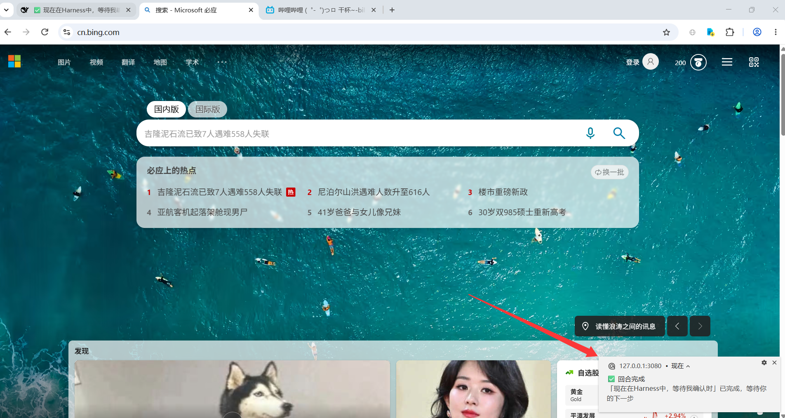
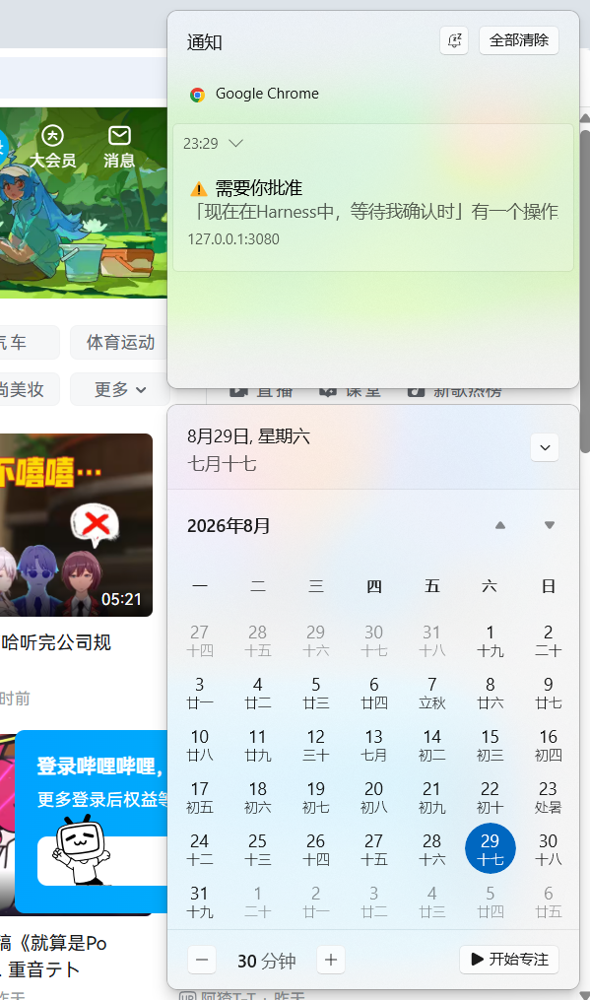

# @dsh-external/dsh-client-ui-notifications

**中文** | [English](README.en.md)

DSH Web 的「等待 / 完成」通知插件：当你切去做别的事情时，DSH 需要你回来处理（等待批准 / 提问、回合完成、出错）会通过 **浏览器系统通知、Tab 标题闪烁、favicon 红点、原生 Windows toast** 提醒你，并可在 **设置 → 通知** 里逐项开关与配置。

## 截图

浏览器通知（Windows 通知中心，来源为浏览器）：



原生 Windows toast（由 DSH Host 进程弹出——浏览器整个关掉也能收到）：



## 提醒机制（与生效条件）

| 场景 | 信号来源（全部是 DSH 原生契约，无需自定义通道） | 默认 |
|---|---|---|
| 等待批准 | 会话快照 `pending` 中出现 `approval` | 开 |
| 等待回答 | 会话快照 `pending` 中出现 `question` | 开（与批准同一开关） |
| 回合完成 | 会话快照 `running: true → false` | 开 |
| 出错 | 会话快照 `lastAgentError` 变为非空 | 开 |

呈现方式（均可配置）：

- **浏览器系统通知**（`Notification` API）：开启时浏览器会请求「允许发送通知」权限——这就是你熟悉的「网站想发送通知」体验；允许后即使切到其他窗口，也会在系统通知中心收到。
- **Tab 标题闪烁**：后台标签页标题在「⚠ / ✅ 前缀 + 原标题」间交替，最多 30 秒，回到页面即恢复。
- **favicon 红点**：后台标签页的 favicon 覆盖红点，回到页面即恢复。
- **声音**：WebAudio 短哔声（首次在页面点击/按键后自动预热，规避浏览器自动播放策略）。
- **原生系统通知**（`nativeToast` 开关，默认关）：由 DSH Host 进程直接弹 Windows toast——**浏览器整个关掉也能收到**。零依赖（内置 WinRT 实现，经 Windows PowerShell 5.1 调用）；若安装了 BurntToast 模块则自动使用它获得更美观的样式。Host 半改动需重启生效。
- **冷却**：同类通知默认 30 秒内只提醒一次，可调。

提醒只在窗口**未被聚焦**（后台标签或切到别的窗口）时触发，不打扰正在盯着 DSH 的你。

## 结构

- `src/index.ts` —— Host 半源码（TypeScript）：注册 `notifications` 设置命名空间（schemastery schema + 默认值），监听 `approval/request` / `agent/status` / `agent/error` 并弹原生 Windows toast（零依赖 WinRT，可选 BurntToast）。
- `src/client/index.ts` —— Client 半源码（TypeScript）：监听 `sessions.list` / 各会话快照，检测上述信号并呈现通知；注册 `settings.section` 设置页；内置 zh/en 双语文案。
- `build.mjs` —— 构建脚本（esbuild）：`src/index.ts` → `lib/index.js`（ESM），`src/client/index.ts` → `lib/client.js`（`window.__ModuleLoader__` bundle）。
- `lib/` —— 构建产物（已提交；安装时直接使用）。
- `cordis.patch.yml` —— 把本包的组合行插入 profile（与已安装的皮肤包同机制，`dsh.bundle.patch` 自动生效）。

## 开发 / 构建

```sh
pnpm install        # 安装 esbuild / typescript 等 devDependencies
pnpm build          # 重新生成 lib/index.js + lib/client.js
pnpm typecheck      # tsc --noEmit（可选）
```

提交规则：`lib/` 是构建产物且**需要提交**（github: 安装不跑构建）。改 `src/` 后先 `pnpm build` 再提交；CI（`.github/workflows/build.yml`）会校验 lib/ 是否与构建一致。

## 安装

**从 GitHub 安装（共享版）**——在 `~/.dsh/profiles/<你的profile>/package.json` 中：

```json
{
  "dependencies": {
    "@dsh-external/dsh-client-ui-notifications": "github:huangDouP/dsh-client-ui-notifications"
  },
  "dsh": {
    "profile": {
      "bundles": [
        "@deepseek-ai/dsh-base",
        "@deepseek-ai/dsh-web-app",
        "@dsh-external/dsh-client-ui-notifications"
      ]
    }
  }
}
```

然后 `pnpm install`，**重启 dsh**（新增插件集合只在重启后生效）。

> 若仓库是 monorepo、包在子目录：用 `github:<user>/<repo>#path:/<subdir>`。
> 与皮肤包同机制——bundle 自身的 `cordis.patch.yml`（`dsh.bundle.patch`）会在 profile 加载该 bundle 时自动插入组合行，不需要手工改 profile 的 `cordis.patch.yml`。

**本地开发安装**：`"@dsh-external/dsh-client-ui-notifications": "file:<本包绝对路径>"`，或复制进 `node_modules/@dsh-external/`。

重启后打开 **设置 → 通知** 即可看到全部开关并逐项配置（启用通知 / 等待批准 / 回合完成 / 出错 / 浏览器系统通知 / 原生系统通知 / Tab 标题闪烁 / favicon 红点 / 声音 / 冷却）。

## 卸载

1. 编辑 `~/.dsh/profiles/<你的profile>/package.json`：
   - 从 `dependencies` 删除 `"@dsh-external/dsh-client-ui-notifications": ...` 那一行；
   - 从 `dsh.profile.bundles` 数组中删除 `"@dsh-external/dsh-client-ui-notifications"` 那一行。
2. 在 `~/.dsh/profiles/<你的profile>` 下执行 `pnpm install`（把包从 node_modules 中清掉）。
3. **重启 dsh** —— 插件集合的增删只在重启后生效；bundle 自带的 `cordis.patch.yml` 插入行会随 bundle 移除自动消失，无需手工改 profile 的 patch 文件。

可选清理：

- **设置残留**：编辑 `~/.dsh/settings.yaml`，删除 `notifications:` 段（恢复出厂默认）；
- **浏览器通知授权**：浏览器设置 → 网站设置 → 通知，移除对 `127.0.0.1:3080` 的授权；
- Tab 标题 / favicon 属于插件运行期改动，重启后自动恢复，无需处理。

## 已知限制

- 浏览器通知依赖页面处于打开状态（标签页可以后台，但不能关闭整个标签页）；**原生系统通知**（`nativeToast` 开关）则由 Host 直接弹 Windows toast，浏览器整个关掉也能收到（零依赖 WinRT；装 BurntToast 模块可获得更美观样式）。
- `error` 检测依赖 `lastAgentError` 快照字段；子代理 / 工作流结束通知未纳入 v1（会话快照不含该信号）。
- 设置页是「正式模块」级持久设置（写入 `~/.dsh/settings.yaml`），重启不丢；这与动态插件的临时设置不同。
